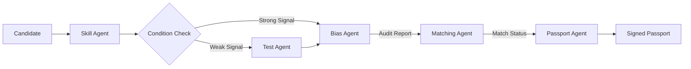

# 🚀 Fair Hiring Pipeline - System Documentation

**Version:** 2026.1 "Judge-Ready"
**Architecture:** Multi-Agentic Trust Pipeline
**Goal:** Verifiable, Bias-Aware, and Honest Hiring signal.

---

## ⚡ Quick Start (The "One Command")

Run the entire pipeline (Scraping → Verification → Testing → Bias Audit → Matching → Passport) with a single command:

```bash
python skill_verification_agent/run_complete_workflow.py --github <USERNAME>
```

### Example
```bash
python skill_verification_agent/run_complete_workflow.py --github torvalds
```

### Output Artifacts
| File | Purpose | Key Agent |
| :--- | :--- | :--- |
| `final_credential.json` | Tiered skills & confidence score | Skill Verification Agent |
| `bias_report.json` | Audit of systemic bias (Gender/College) | Bias Detection Agent |
| `match_result.json` | Honest match status (e.g. CONDITIONAL) | Transparent Matching Agent |
| `passport_credential.json` | **SIGNED** Immutable Credential | Passport Agent |

---

## 🏛️ System Architecture

The system is composed of **5 Specialized Agents** designed to separate concerns between *Evaluation*, *Audit*, and *Decision*.



---

## 🕵️ Agent Roles & Commands

### 1. Skill Verification Agent (The Judge)
**Location:** `skill_verification_agent/`
Evaluates raw evidence (GitHub, LeetCode, Resume) to produce a trustworthy confidence score.
- **Key Logic:** Tiered Taxonomy ("Core" vs "Frameworks"), Noise Filtering.
- **Run Individually:**
  ```bash
  python skill_verification_agent/agents/skill_verification_agent_v2.py <evidence_graph.json>
  ```

### 2. Conditional Test Agent (The Gatekeeper)
**Location:** `skill_verification_agent/agents/conditional_test_agent.py`
Dynamic dispatcher that triggers technical assessments only when signals are weak.
- **Key Logic:** If `skill_confidence < 70`, `test_required = True`.

### 3. Bias Detection Agent (The Auditor)
**Location:** `bias_detection_agent/`
Monitors the pipeline for systemic bias (Gender, College) using statistical batch analysis.
- **Key Logic:** Does **NOT** alter scores. Flags systemic gaps for human review.
- **Run Individually:**
  ```bash
  python bias_detection_agent/agents/bias_detection_agent.py
  ```

### 4. Transparent Matching Agent (The Recruiter)
**Location:** `matching_agent/`
Matches candidates to Job Descriptions using "Honest Logic".
- **Key Logic:** Missing Core Skill = `CONDITIONAL_MATCH` (Not Rejection).
- **Run Individually:**
  ```bash
  python matching_agent/agents/matching_agent.py
  ```

### 5. Passport Agent (The Trust Anchor)
**Location:** `passport_agent/`
Finalizes the process by creating an immutable, cryptographically signed credential.
- **Key Logic:** HMAC-SHA256 Signing. Returns Verification URL.
- **Run Individually:**
  ```bash
  python passport_agent/agents/passport_agent.py
  ```

---

## 🔐 Security & Compliance

1.  **Identity Split:** `user_id` (Auth) is strictly separated from `evaluation_id` (Process).
2.  **Read-Only Audit:** Bias Agent has no write access to the matching score.
3.  **Immutable Logs:** All decisions are logged in the `pipeline_context.json` and signed in the Passport.

---

## 📂 Directory Structure

```text
/
├── skill_verification_agent/   # Step 1-2: Evidence & Testing
├── bias_detection_agent/       # Step 3: Fairness Audit
├── matching_agent/             # Step 4: Job Matching
├── passport_agent/             # Step 5: Credential Issuance
└── pipeline_context.json       # Shared session context
```
